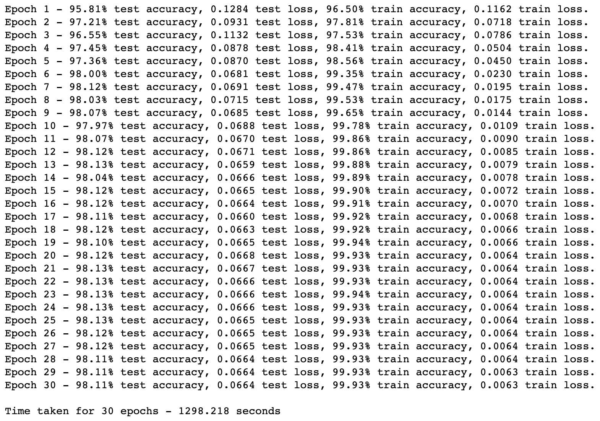
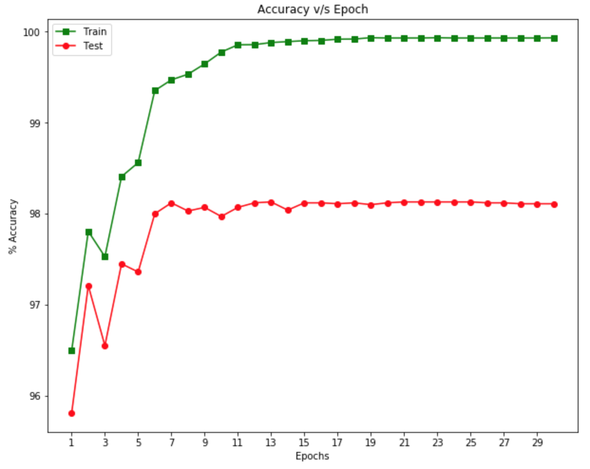
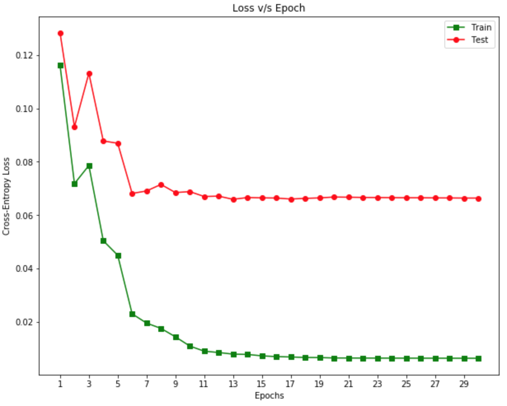

# CS-547 | IE-534 : Homework 1

### Author - Akhil Gupta

### Problem Description
Implement and train a neural network from scratch in Python for the MNIST dataset (no PyTorch). The neural network should be trained on the Training Set using stochastic gradient descent. It should achieve 97-98% accuracy on the Test Set. For full credit, submit via Compass (1) the code and (2) a paragraph (in a PDF document) which states the Test Accuracy and briefly describes the implementation. Due September 6 at 5:00 PM.

### Performance on Test
- Accuracy - <b>98.11%</b>
- Run time - <b>22 minutes</b>

### Execution
Use Python3 for running the code file.

### Results

