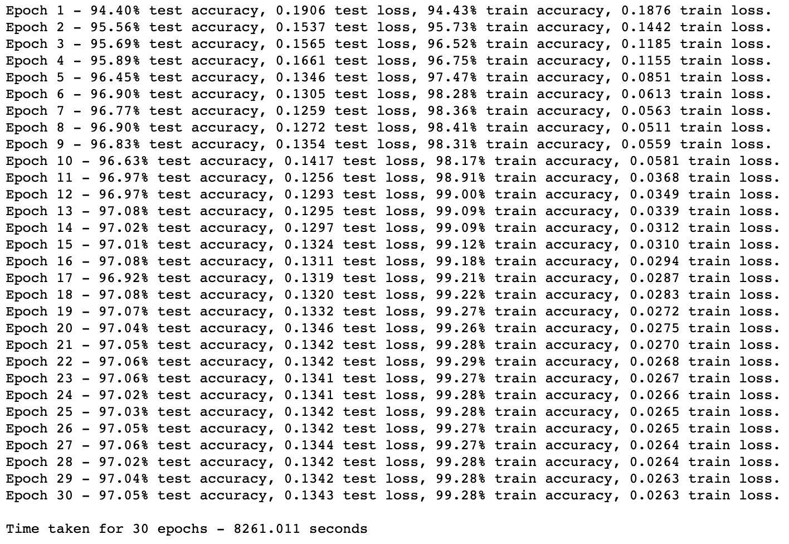
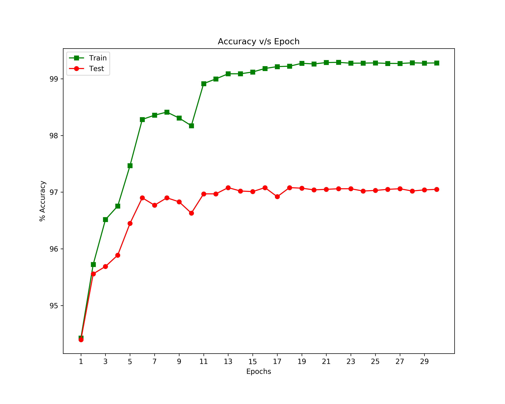
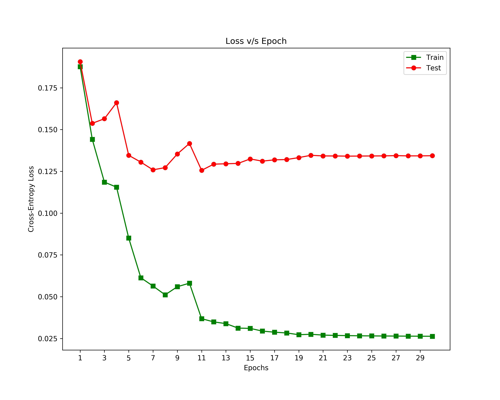

# CS-547 | IE-534 : Homework 2

**Author** - Akhil Gupta

Implement and train a convolution neural network from scratch in Python for the MNIST dataset (no PyTorch). You should write your own code for convolutions (e.g., do not use SciPy's convolution function). The convolution network should have a single hidden layer with multiple channels. It should achieve at least 94% accuracy on the Test Set. For full credit, submit via Compass (1) the code and (2) a paragraph (in a PDF document) which states the Test Accuracy and briefly describes the implementation. Due September 18 at 5:00 PM.

### Performance on Test
- Accuracy - <b>97.05%</b>
- Run time - <b>2 hours 18 minutes</b>

### Execution
Use Python3 for running the code file.

### Results

